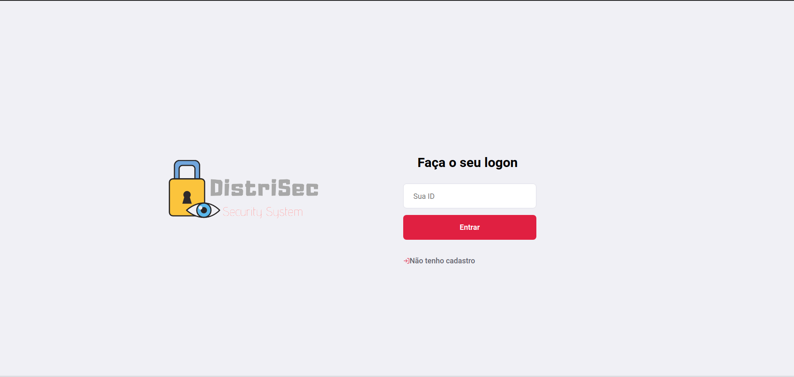
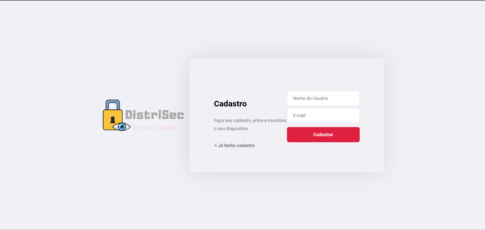
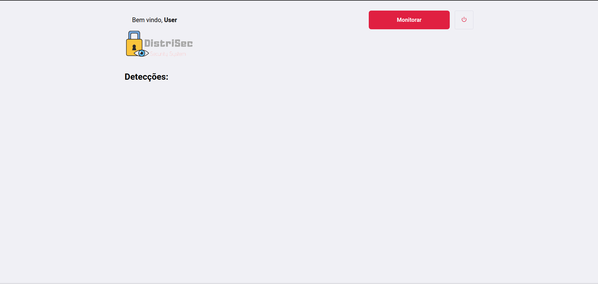
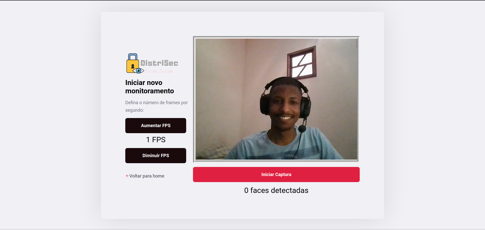
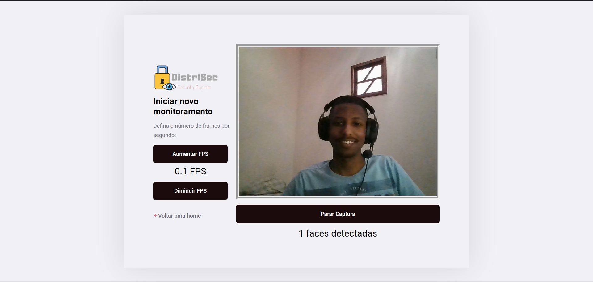
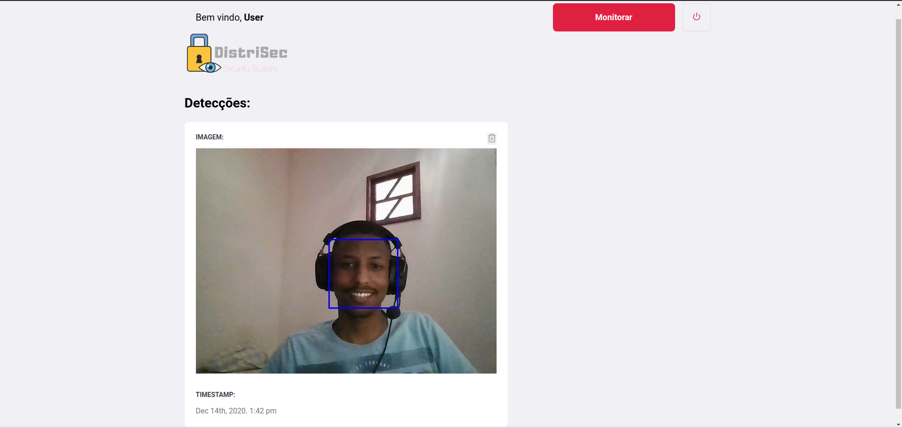
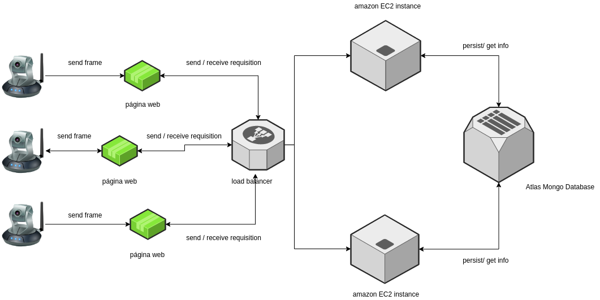

# DistriSec
Distributed system for monitoring using cameras.

##### This project was made using ReactJS and NodeJS.












## The System

Distributed face detection system for security purposes. If a face is detected, the image is persisted in the database.

The modeling of the system guarantees:

- Vertical scaling
   - Each server works in cluster mode, which creates an instance for each core of the machine that runs it;
- Horizontal scaling
   - The balancer guarantees the insertion of several instances of the server;
- Data consistency
   - The database has a main instance and two secondary replicas;
   


## Build project

##### Run back-end
```
backend/

Install node modules:
npm install

Start:
npm start
```

##### Run front-end
```
frontend/

Install node modules:
npm install

Start:
npm start
```
